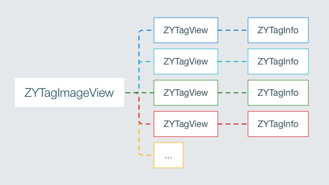

# ZYTagView

公司的项目需要这个功能，写了之后顺便提取出来写了一个 demo，简单实现图片添加标签，暂时没有去处理图片宽度小于标签长度的情况。

## 效果图


## 类介绍



主要有三个类

1. ZYTagImageView 

	继承自 `UIImageView` ，主要处理其上的所有标签

2. ZYTagView 

	继承自 `UIView` ，标签视图，处理标签的各种手势，并利用代理进行回调

3. ZYTagInfo

	继承自 `NSObject`，存储标签的信息，可存储具体位置以及当前点在父视图的位置比例（建议使用位置比例，在不同尺寸的屏幕上才能正常显示）
	
一个 `ZYTagImageView` 可以添加多个 `ZYTagView`，每个 `ZYTagView` 对应着一个 `ZYTagInfo`，所有标签位置信息均存储在 `ZYTagInfo` 中。

## 标签交互

类似微博的图片添加标签分为两种状态，一种是编辑标签状态，另一种是微博发出之后浏览其他人添加的标签的浏览状态。

### 编辑状态

添加标签拖动交互主要有以下几个点：

1. 拖动边界控制

	根据圆点的位置进行限制拖动

2. 边界标签方向翻转

	在拖动手势状态为 `UIGestureRecognizerStateEnded` 时候，检测是否能够放下删除按钮，不能则进行反向

3. 轻触显示与隐藏删除按钮

	默认轻触标签显示和隐藏删除按钮，此时重新布局标签子控件位置；在拖动手势开始的时候，隐藏删除按钮

4. 长按编辑标签

	遵守代理，即可获取到当前标签数据，进行修改

5. 闪烁动画

	利用一个帧动画简单实现闪烁，根据传入的 `repeatCount` 决定动画闪烁多久

### 预览状态

供他人浏览，不可编辑，利用代理模式回调标签的轻触和长按手势。

## 简单使用

导入 `#import "ZYTagImageView.h"` 

初始化 `ZYTagImageView `

```objc
ZYTagImageView *imageView = [[ZYTagImageView alloc] initWithImage:image];
imageView.delegate = self;
imageView.frame = CGRectMake(100, 100, 100, 100);
[self.view addSubview:imageView];
```

添加一个标签

```objc
[imageView addTagWithTitle:@"我是一个标签" point:CGPointMake(30, 40) object:nil];
```

删除所有标签

```objc
[imageView removeAllTags];
```

设置为预览模式

```objc
[imageView setAllTagsEditEnable:NO];
```

自定义手势处理，需遵守 `ZYTagImageViewDelegate`，实现以下代理方法

```objc
/** 轻触imageView空白区域 */
- (void)tagImageView:(ZYTagImageView *)tagImageView activeTapGesture:(UITapGestureRecognizer *)tapGesture;
/** 轻触标签 */
- (void)tagImageView:(ZYTagImageView *)tagImageView tagViewActiveTapGesture:(ZYTagView *)tagView;
/** 长按标签 */
- (void)tagImageView:(ZYTagImageView *)tagImageView tagViewActiveLongPressGesture:(ZYTagView *)tagView;
```

更多用法下载 demo 查看~